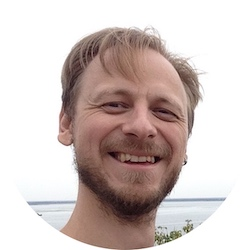

# Vsevolod Gribov #

C/C++ developer.

## Summary ##

An experienced C/C++ developer with a pragmatic and minimalistic approach. I
started writing my first C programs and discover the Linux Kernel in middle
school. Now I have a fundamental computer science education and more than
10-year experience in fields from machine control systems to networking and
automotive. I am not afraid of difficulties and know how to solve problems
right.

An overview of my career includes these highlights:

* Luxoft: As a senior C++ developer I am working with Qt framework on behalf of
  Daimler to implement HMI for their new infotainment system. I focus mostly on
  startup and performance issues and responsible for communication with backend
  services.
* Larch Networks: As a lead developer I've participated in creating an
  OpenSwitch ASIC plugin for the newest Marvell Bobcat 3 packet processor. Then
  as a team lead, I've ported it on Cortex-A9 CPU with Aldrin packet processor.
  I've also developed "from scratch" a C++ written DHCPv6 server for Panasonic
  enterprise switches.
* UnIT: Working mostly with Qt, I've developed workstation software for an
  excise stamps quality control system, a fingerprint recognition system, and
  mobile passport issuance system.
* SKBIS: As a result of my university research, I've developed an automatic
  position sensor adjustment system. I've also developed firmware for 9 of 10
  modules in SKBIS's machine tool position control system.

## Great development experience in C language ##

I started writing my first C programs in the 8th school's grade. Now I'm a C
language native speaker, knowing both POSIX and latest C99 standards and GNU
extensions. I wrote programs mostly for reliable embedded systems, starting
from small AVR OS-less applications ending with complex Linux-based open-source
projects such as OpenSwitch.

## Good knowledge of C++ and Qt ##

In parallel with C, I've been constantly working with C++. Mainly for creating
user-friendly GUI based workstation applications. Tired from MFC during my work
in SKBIS I decided to try Qt and now that's my favorite GUI framework. I used
it heavily during my work in UnIT and I was always able to achieve the required
result in a very short time. In 2014 I got carried away with C++11. I've
written a DHCPv6 server on pure C++11 using only STL. Now I am working on a
Qt-based HMI for Daimler which is written in QML and C++11 with elements of
C++14.

## Scripting languages for testing and automation ##

I started to use PHP as a hobby and as part-time making web sites while
studying at university. Then I switched to Perl as a wonderful tool to automate
my everyday development tasks in SKBIS. Now I use bash scripts, Makefiles, and
Python for automation, complex feature testing and code generation.

## Solid understanding of Linux on embedded systems ##

At the programming classes in the middle school, we used FreeBSD on our
workstations and discover the Linux kernel sources. Over the past few years,
I've studied Linux along and across. I've ported Linux on at least 3 different
embedded platforms, working with both U-Boot and kernel sources. I've used
BuildRoot and Yocto and even handwritten scripts to generate a Linux root
file system. I also have some experience with Wayland, which is used heavily in
automotive HMIs.

## Real life experience with networking protocols and Marvell chips ##

I have been working in networking for more than two and a half years. In Larch
Networks I worked on creating a security WiFi USB dongle based on TI's Sitara
SOC and WL1837MOD. I've also participated in developing a FreeRTOS based
solution for clever unmanaged switches with Marvell's AlleyCat3, BobCat2 and
BobK packet processors inside. I've worked both with CPSS library and packet
processor registers directly, setting up Multicast groups, VLANs and policies
for our customers. I've worked on developing an OpenSwitch FPA plugin for
BobCat3, implementing access lists, VLAN interfaces, and L3 routing. I've
developed "from scratch" a DHCPv6 server for Panasonic and ported the FPA
library on Aldrin packet processor.

## Experience with various collaboration software ##

During my work life, I have worked with various task tracking systems, and
collaboration software, such as Redmine, GitLab, BitBucket, Jira, Confluence,
Slack, and Zulip. Last 5 years I constantly work with the Scrum framework. I
prefer to use Git as a version control system and also have some experience
with SVN, CVS, and Mercurial.

## Creativity and self-learning ability ##

I love to write programs, for me, that's not only an algorithm formalization
but also an exciting chance to create something new. I love the code simplicity
and prefer the minimalistic approach. I can be agile but prefer to have a clear
specification with a road map and milestones. Before each new project, I tend
to ask myself "what's new I can learn from it?". If nothing I try to introduce
this "new" into the project by myself. I like being a team change agent.

## Communication and leadership skills ##

Most of the time I have been working in small teams of two or three people. For
the last several years I have been constantly involved in projects with
international teams, communicating over e-mail, Skype, Zoom, task tickets and
peer reviews. My colleagues note my responsiveness and ability to maintain a
friendly atmosphere of mutual assistance. In Larch Networks I have also had six
months of experience being a team lead of a small command consisting of five
developers.

## Employment ##

### Senior C++ Developer in Luxoft, Germany ###

<http://www.luxoft.com>

 - **Dates**: 2018 - now.
 - **Company description**: an international custom software development
   company with more than 13,000 employees, 42 offices in 21 countries in North
   America, Western and Eastern Europe, Asia Pacific, and South Africa.
 - **Responsibilities**: Embedded software development for automotive
   equipment. HMI and system programming in C++ and QML. Software stability and
   performance analysis. Interconnection with backend services.

### Senior C++ Developer in Luxoft, Ukraine ###

<http://www.luxoft.com>

 - **Dates**: 2017 - 2018.
 - **Company description**: an international custom software development
   company with more than 13,000 employees, 42 offices in 21 countries in North
   America, Western and Eastern Europe, Asia Pacific, and South Africa.
 - **Responsibilities**: Embedded software development for automotive
   equipment. HMI and system programming in C++ and QML. Implementation of
   communication protocols with backend services.

### Developer and Team Leader in Larch Networks, Israel ###

<http://www.larch-networks.com>

 - **Dates**: 2015 - 2017.
 - **Company description**: A systems engineering, implementation and
   deployment company.
 - **Responsibilities**: Embedded software development for networking
   equipment. Board bring-up. Network Protocols implementation. Business trips
   and work at the customer's side. Setting tasks and writing reports.

### Developer in UnIT, Ukraine ###

<http://unit.com.ua>

 - **Dates**: 2014 - 2015
 - **Company description**: Ukrainian IT company, leader of national automated
   computer systems development and integration market.
 - **Responsibilities**: Workstation software development.

### Software Engineer in RIVS, Russia ###

<http://www.rivs.ru>

 - **Dates**: 2013 - 2014
 - **Company description**: Russian company, which comprehensively solves
   the problem of mineral processing.
 - **Responsibilities**: Software development for analyzer. Research.

### Software Engineer in SKBIS, Russia ###

<http://www.skbis.ru>

 - **Dates**: 2008 - 2013
 - **Company description**: Russian manufacturer of motion sensors for
   mechanical engineering.
 - **Responsibilities**: Embedded and workstation software development.
   Schematics development. Board bring-up. Preparation of specifications
   and documentation. Research.

## Education ##

 - In 2002 graduated from Anichkov Lyceum in St. Petersburg and entered the
   Faculty of Technical Cybernetics of Saint-Petersburg State Polytechnic
   University, to the Department of Information Systems for Environmental
   Safety.
 - In 2006 perfectly defended the work on the "X-ray inspection system for
   welded joints" in Saint-Petersburg State Polytechnic University and received
   a bachelor's degree in engineering and technology in the direction of
   "Instrument-Making"
 - In 2008 defended an excellent thesis on "The automatic adjustment system for
   optical motion sensors" in Saint-Petersburg State Polytechnic University and
   received a master's degree of engineering and technology in the direction of
   Instrument making. Specialized "Microprocessor tools and measurement
   software".

## Languages ##

Russian (Native), English (Fluent), German (Intermediate)

## Personal information ##

I love jazz music and author's cinema. A few years ago I used to spend my spare
time somewhere in the mountains with my snowboard. Now I prefer to be with my
family doing all sorts of nonsense with my 2-year-old son.

## Contact Settings ##

Please feel free to contact me via my [e-mail](mailto:seva.grbv@gmail.com).
Always happy to advice if I can be of help.

**Interested in**:

 - Modern C++
 - C-based open source projects
 - Linux Kernel development
 - System programming
 - Networking software
 - Embedded Qt
 - Wayland

