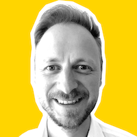

# Vsevolod Gribov #

## Summary ##

An embedded C/C++ (and Go) developer with a simplistic approach.

I started writing my first C/C++ programs and discovering the Linux kernel in middle school. Now, I
hold a Master of Science in Engineering and have 15 years of experience in areas ranging from
machine control systems to networking, automotive and aviation. My passion is to make things
simpler, faster and safer.

An overview of my career includes these highlights:

- **AERQ GmbH**: As a senior embedded developer, I ported LG's WebOS to the 64-bit *VMware*
  platform. I wrote a simple *Wayland* compositor based on hardware planes that enabled 4K
  DRM-protected video playback on the *NXP i\.MX 8M* platform. I've integrated *Qt* applications as
  lightweight *systemd*-containers, learned *Golang* and implemented a custom *K8s* controller to
  install them on all in-seat displays in a cluster.
- **Luxoft GmbH**: As a senior C++ developer, I worked with the *Qt* framework on behalf of Daimler
  to build their in-car infotainment system. I focused mostly on stability and performance issues
  and communication with backend car services. I also participated in porting the HMI to the
  Android platform.
- **Larch Networks**: As a lead developer, I've participated in creating the *OpenSwitch* ASIC
  plugin for the newest *Marvell Bobcat 3* packet processor. Then, as a team lead, I ported it to
  the *Cortex-A9* CPU with the *Aldrin* packet processor. I've also developed "from scratch" a
  *DHCPv6* server for Panasonic enterprise switches, written using only the C++ standard library
  and Linux syscalls.
- **UnIT**: Working mostly with *Qt*, I've developed workstation software for an excise stamp
  quality control system, a fingerprint recognition system, and a mobile passport issuance system.
- **SKBIS**: As a result of my university research, I've developed an automatic position sensor
  adjustment system based on the Texas Instruments *TMS320* DSP and the *iC-MQ* interpolator. I
  developed firmware for most of the machine tool position control system modules and wrote parts
  of the high-speed logic (mostly counters) in *Verilog*.

## Advanced C/C++ knowledge

I started writing my first C and C++ programs in the 8th grade. Since then, I've written programs
mostly for embedded systems, starting with small *AVR* bare-bones applications and ending with
complex networking open-source projects such as OpenSwitch and *Qt*-based HMIs for automotive and
aviation.

In 2014, I got carried away with *modern C++*. At Larch Networks, I've written a *DHCPv6* server
using only the *C++11* standard library. Since then, I've tried to stay aligned with the latest C++
standards (up to *C++20*) and follow the *Core Guidelines*. At Luxoft and AERQ I've participated in
the hiring process and performed dozens of C/C++ coding interviews.

## Experience with the Qt Framework (desktop/embedded)

Tired of Microsoft's MFC during my work in SKBIS I decided to try *Qt*. At that time, it was
Trolltech's Qt 4. Then I moved to Kyiv and started to work in UnIT, where I developed Qt-based HMIs
for an excise stamp quality control system and a mobile passport issuance system.

At Luxoft, working on in-car infotainment systems for Daimler, I learned *QML* and gathered lots of
experience with *Qt/QML* safety, performance and stability issues. I applied this knowledge later
at AERQ, where in just one month I wrote a simple Qt browser application to replace the slow
JS-based UI for the new in-flight entertainment system.

## Solid understanding of embedded Linux

In the programming classes in the middle school, we used FreeBSD on our workstations and discovered
the *Linux kernel* sources. Lately, I've studied Linux from different angles. At Larch Networks,
I've ported Linux to at least three different embedded *ARM*-based platforms, adjusting both
*U-Boot* and *Linux kernel* sources and writing custom *device trees* based on schematics. I've
used *BuildRoot*, *Yocto* and even some handwritten scripts to generate a simple Linux root file
system.

At AERQ I started using *Systemd* containers and *portable services* and wrote *BitBake* receipts to
produce minimal root filesystems and SDKs for them. I also wrote a simple *Wayland* compositor
based on *libdrm* and *EGL* to enable hardware-accelerated video playback on the *i\.MX 8M*
platform.

## Experience with containers, Kubernetes and Go

I started to use *Docker* at Larch Networks as a lightweight virtual machine to set up clean
development environments for different target platforms. Working on the *OpenSwitch* ASIC plugin, we
used *pytest* and *Docker containers* to create simple network topologies for testing.

At AERQ, due to some aviation regulations, we containerize all user applications, which can be
either web-based or native. In-seat displays form a large distributed system, which is split into
*K8s clusters* to increase reliability and share hardware resources. The whole system is declared
as a collection of *K8s resource definitions* and controlled by *K8s controllers*. We also deploy
some pluggable functionality, which should be available *before* the cluster is set up, as *Systemd
portable services*.

I am working to integrate native applications, which are run as *Systemd containers* and deployed
on each in-seat display as *OCI images* by a custom *K8s* controller written in *Go*. We use
*buildah* and *Yocto* to produce optimized application images and portable services.

## Real-life experience with networking protocols and Marvell chips

I have been working in networking for more than two and a half years at Larch Networks. I worked on
creating a security *WiFi USB dongle* based on *TI Sitara SOC* and *WL1837MOD*. I also participated
in developing a *FreeRTOS* based solution for clever unmanaged switches with Marvell's *AlleyCat3*,
*BobCat2* and *BobK* packet processors inside. I worked both with the Marvell's *CPSS* library and
packet processor registers directly, setting up *Multicast groups*, *VLANs* and different policies.
I developed parts of the *OpenSwitch* ASIC plugin for *BobCat3*, implementing *access lists*, *VLAN
interfaces*, and *L3 routing*. I developed "from scratch" a *DHCPv6* server and ported the
Marvell's *FPA* library to the *Aldrin* packet processor.

## Knowledge of microcontrollers, schematics and measurement technologies

During my work at Larch Networks, I dealt with complex schematic diagrams of network equipment to
configure *device trees* and adjust *Linux kernel modules* to the boards' hardware. At SKBIS, I
designed and implemented a measurement device based on the *TMS320 DSP*, which was used to adjust
*optical motion sensors*. I worked with *Altium*, *Multisim*, and *Quartus* and had some
experience with *Altera FPGAs* and *Verilog*. I also wrote firmware for several modules of the
position control system, which were based on *AVR ATmega* and *AT90* chips.

## Scripting languages for testing and automation ##

I started to use PHP as a hobby and as a part-time job, making web sites while studying at university. Then I switched to Perl as a wonderful tool to automate my everyday development tasks. Currently, I use Python and bash scripts for automation, complex feature testing, and code generation.

## Experience with various collaboration software ##

I have worked with various task tracking systems, and collaboration software, such as Redmine, GitLab, BitBucket, Jira, Confluence, Slack, and Zulip. Last 5 years I constantly work with the Scrum framework. I prefer to use Git as a version control system and also have some experience with SVN, CVS, and Mercurial.

## Creativity and self-learning ability ##

I love to write programs. For me, it's an exciting chance to create something new and make our world better. I love code simplicity and minimalistic approach with a focus on using the standard library and avoiding unneeded external dependencies. I can be agile but prefer to have a clear specification with a road map and milestones. Before each new project, I tend to ask myself "what's new I can learn from it?". If nothing I try to introduce this "new" by myself. So I like being a team change agent.

## Communication and leadership skills ##

For the last several years I've always worked in international teams, communicating over e-mail and Zoom meetings, assigning tickets, and making code reviews on Gerrit. My colleagues note my responsiveness and reliability. At my workplace, I try to maintain a friendly atmosphere of mutual assistance. In Larch Networks I also have had six months of experience leading a team of five developers.

## Employment ##

### Senior C++ Developer in Luxoft, Germany ###

<http://www.luxoft.com>

 - **Dates**: 2018 - now.
 - **Company description**: an international software development company with more than 13,000 employees, 42 offices in 21 countries in North America, Western and Eastern Europe, Asia Pacific, and South Africa.
 - **Responsibilities**: Embedded software development for automotive equipment. HMI and system programming in C++ and QML. Software stability, performance analysis and communication with backend services.

### Senior C++ Developer in Luxoft, Ukraine ###

<http://www.luxoft.com>

 - **Dates**: 2017 - 2018.
 - **Company description**: an international software development company with more than 13,000 employees, 42 offices in 21 countries in North America, Western and Eastern Europe, Asia Pacific, and South Africa.
 - **Responsibilities**: Embedded software development for automotive equipment. HMI and system programming in C++ and QML. Implementation of communication protocols with backend services.

### Developer and Team Leader in Larch Networks, Israel ###

<http://www.larch-networks.com>

 - **Dates**: 2015 - 2017.
 - **Company description**: A systems engineering, implementation and deployment company.
 - **Responsibilities**: Embedded software development for networking equipment. Board bring-up. Network Protocols implementation. Business trips and work at the customer's side. Setting tasks and writing reports.

### Developer in UnIT, Ukraine ###

<http://unit.com.ua>

 - **Dates**: 2014 - 2015
 - **Company description**: Ukrainian IT company, leader of national automated computer systems development and integration market.
 - **Responsibilities**: Workstation software development.

### Software Engineer in RIVS, Russia ###

<http://www.rivs.ru>

 - **Dates**: 2013 - 2014
 - **Company description**: Russian company, which comprehensively solves the problem of mineral processing.
 - **Responsibilities**: Software development for analyzer. Research.

### Software Engineer in SKBIS, Russia ###

<http://www.skbis.ru>

 - **Dates**: 2008 - 2013
 - **Company description**: Russian manufacturer of motion sensors for mechanical engineering.
 - **Responsibilities**: Embedded and workstation software development. Schematics development. Board bring-up. Preparation of specifications and documentation. Research.

## Education ##

 - In 2002 graduated from Anichkov Lyceum in St. Petersburg and entered the Faculty of Technical Cybernetics of Saint-Petersburg State Polytechnic University, to the Department of Information Systems for Environmental
   Safety.
 - In 2006 perfectly defended the work on the "X-ray inspection system for welded joints" in Saint-Petersburg State Polytechnic University and received a bachelor's degree in engineering and technology in the direction of
   "Instrument-Making"
 - In 2008 defended an excellent thesis on "The automatic adjustment system for optical motion sensors" in Saint-Petersburg State Polytechnic University and received a master's degree of engineering and technology in the direction of Instrument making. Specialized "Microprocessor tools and measurement software".

## Languages ##

Russian (Native), English (Fluent), German (Intermediate)

## Personal information ##

I love jazz music and author's cinema. A few years ago I used to spend my holidays in the mountains with my snowboard. Now I prefer to be with my family doing all sorts of nonsense with my 3-year-old son.

## Contact Settings ##

Please feel free to contact me via my [e-mail](mailto:seva.grbv@gmail.com). Always happy to advice if I can be of help.

**Interested in**:

 - Algorithms and data structures
 - Modern C++
 - C-based open source projects
 - Linux Kernel development
 - System programming
 - Networking software
 - Embedded Qt

